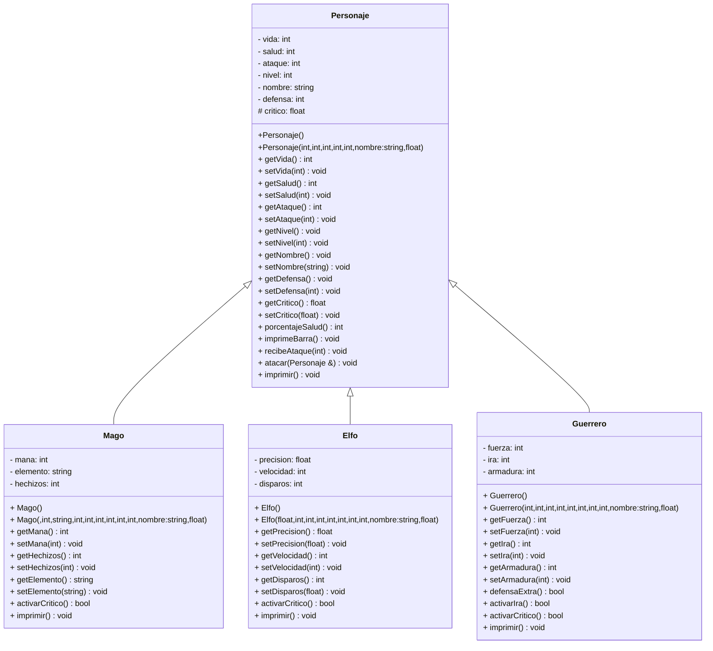

# Ejercicio - Hello World

Este proyecto tiene la estructura básica para cualquier proyecto C++. 

La carpeta contiene el código fuente y el archivo de construcción ```make```.

La carpeta `build` contiene el codigo binario generado por el archivo de construcción ```make```.

Consulta el archivo assignments/README.md para instrucciones sobre la compilación y ejecución del proyecto.

## Diagrama UML

